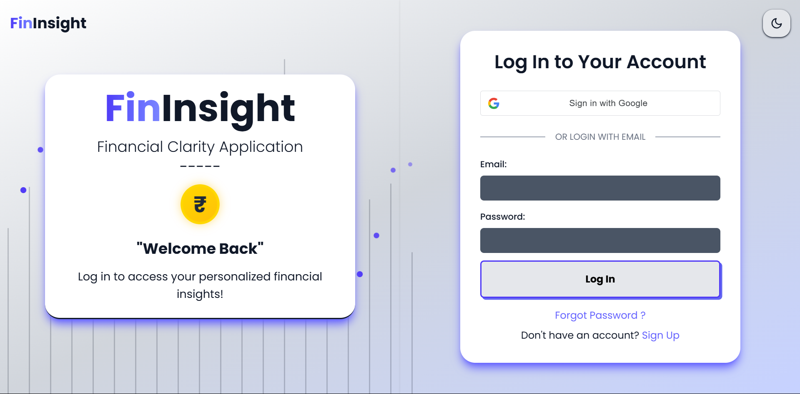
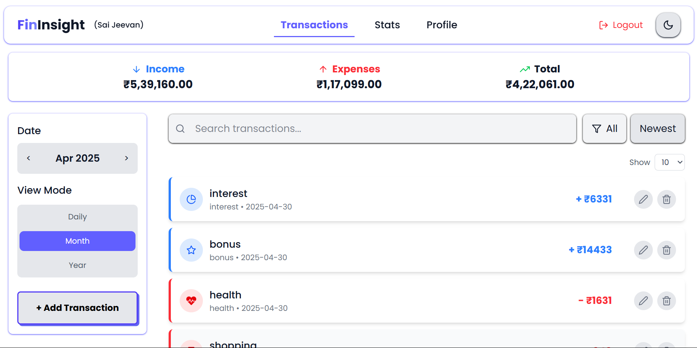
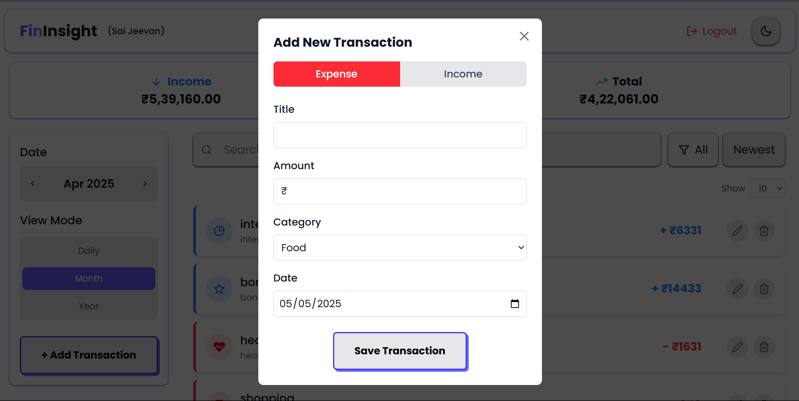

# FinInsight 
**AI Powered Financial Clarity**

##  Overview  
FinInsight is a full-stack AI-powered web application designed to help users manage their personal finances intelligently and securely. Users can add, edit, categorize, and track transactions, visualize financial trends, and receive personalized insights powered by Google's Gemini 1.5 Pro.

---

##  Tech Stack  

**Frontend:**  
- React 19  
- TailwindCSS  
- React Router DOM  
- Chart.js / Recharts  
- Framer Motion  

**Backend:**  
- Flask  
- Flask-JWT-Extended  
- PyMongo  
- RESTful APIs  
- Google Generative AI SDK  

**Database:**  
- MongoDB Atlas  

---

##  Features  
- JWT Authentication and OTP-based password recovery  
- Real-time income & expense tracking  
- Daily, Monthly, Yearly filters with sorting  
- Financial charts & summaries (line, pie, cards)  
- AI-generated insights from transaction patterns  
- Dark mode support for improved accessibility  

---

## 📸 Screenshots

Screenshots of various key pages from the application.

---

### 🏠 Welcome Page  


---

### 🔐 Authentication Pages  

**Login Page**  


**Sign Up Page**  


**Forgot Password (OTP Verification)**  
.png)  
.png)

---

### 💵 Transactions  

**Transactions Dashboard**  


**Add Transaction Page**  


---

### 📊 Statistics  

**Breakdown View**  
.png)

**Trends View**  
- Line Chart  
  .png)

- Income Pie Chart  
  .png)

- Expense Pie Chart  
  .png)

---

### 🧠 AI Insights  

**AI-Powered Analysis**  
.png)

---


## 🛠️ Installation  

### Backend  
```bash  
cd backend  
pip install -r requirements.txt  
```

Create a `.env` file inside `/backend`:

```env
MONGO_URI=your_mongodb_uri  
JWT_SECRET_KEY=your_jwt_key  
GOOGLE_API_KEY=your_google_api_key  
```

Run the backend:

```bash  
python app.py  
```

### Frontend  

```bash  
cd frontend  
npm install  
npm run dev  
```

---

## 📁 Project Structure  

```
saijeevan25-fininsight/  
├── backend/  
│   ├── routes/, models/, utils/  
├── frontend/  
│   ├── src/  
│   │   ├── Pages/, Components/, utils/  
│   └── public/  
```

---

## 🧠 AI Integration  

The AI component uses Gemini 1.5 Pro to:  
- Summarize spending patterns  
- Suggest savings tips  
- Detect anomalies in transactions  

Implemented in:  
- Frontend: `AIInsights.jsx`  
- Backend: `insights.py`  

---

## 🔐 Environment Variables  

```env
MONGO_URI=your_mongodb_uri  
JWT_SECRET_KEY=your_jwt_secret  
GOOGLE_API_KEY=your_gemini_api_key  
```

---

## 👥 Contributors  
- Ashish Pathak   
- Battiprolu Sai Jeevan 
---
$\frac{1}{2}$


